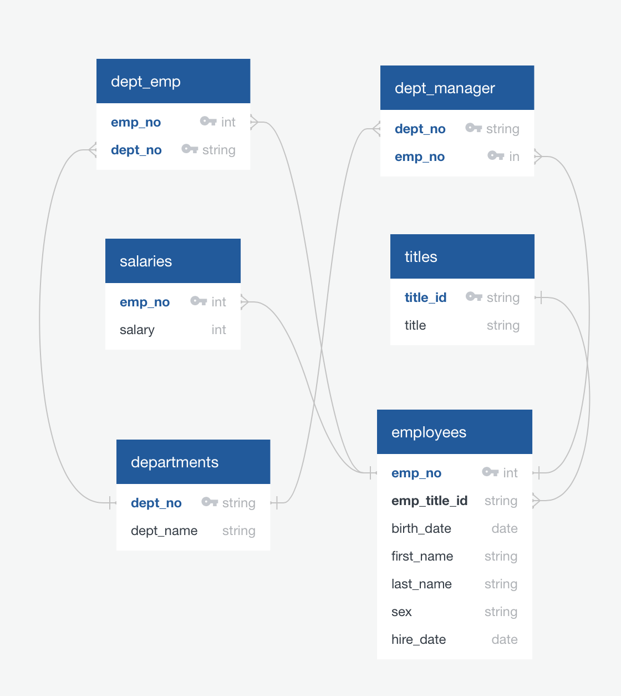

# sql_challenge

## Background
Conduct research on employees working in the 1980s and 1990s at the company Pewlett Hackard. The only data that remains available from the time period are 6 CSV files.

## Objectives
This project consists of designing the tables that will hold the CSV data, import the CSVs into a SQL database, and answer a series of questions about the data. The task consist of:
1. Data Modeling
2. Data Engineering
3. Data Analysis

## Data Modeling
After inspecting the CSVs, create an ERD using Quick Database Diagrams.



## Data Engineering
Create a table schema for each of the 6 CSV files with specific data types, primary keys, foreign keys, and constraints.

```sql
-- create titles table
CREATE TABLE titles (
    title_id VARCHAR,
    title VARCHAR,
    PRIMARY KEY (title_id)
);

-- create departments table
CREATE TABLE departments (
    dept_no VARCHAR,
    dept_name VARCHAR,
    PRIMARY KEY (dept_no)
);

-- create department employees table
CREATE TABLE dept_emp (
    emp_no INT,
    dept_no VARCHAR,
    FOREIGN KEY (emp_no) REFERENCES employees (emp_no),
    FOREIGN KEY (dept_no) REFERENCES departments (dept_no),
    PRIMARY KEY (emp_no, dept_no)
);

-- create department managers table
CREATE TABLE dept_manager (
    dept_no VARCHAR,
    emp_no INT,
    FOREIGN KEY (emp_no) REFERENCES employees (emp_no),
    FOREIGN KEY (dept_no) REFERENCES departments (dept_no),
    PRIMARY KEY (dept_no, emp_no)
);

-- create employees table
CREATE TABLE employees (
    emp_no INT,
    emp_title_id VARCHAR,
    birth_date DATE,
    first_name VARCHAR,
    last_name VARCHAR,
    sex VARCHAR,
    hire_date DATE,
    FOREIGN KEY (emp_title_id) REFERENCES titles (title_id),
    PRIMARY KEY (emp_no)
);

-- create salaries table
CREATE TABLE salaries (
    emp_no INT,
    salary INT,
    FOREIGN KEY (emp_no) REFERENCES employees (emp_no),
	PRIMARY KEY (emp_no)
);
```
## Data Analysis
1. List the following details of each employee: employee number, last name, first name, sex, and salary.

```sql
SELECT emp.emp_no as employee_number, emp.last_name, emp.first_name, emp.sex, sal.salary
FROM employees as emp
LEFT JOIN salaries as sal
ON emp.emp_no = sal.emp_no
ORDER BY emp.emp_no;
```

2. List first name, last name, and hire date for employees who were hired in 1986.

```sql
SELECT first_name, last_name, hire_date
FROM employees
WHERE hire_date BETWEEN '1986-01-01' AND '1986-12-31';
```
3. List the manager of each department with the following information: department number, department name, the manager's employee number, last name, first name.

```sql
SELECT d.dept_no, d.dept_name, dm.emp_no, e.last_name, e.first_name
FROM departments d 
JOIN dept_manager dm ON (d.dept_no = dm.dept_no)
JOIN employees e ON (dm.emp_no = e.emp_no);
```

4. List the department of each employee with the following information: employee number, last name, first name, and department name.

```sql
SELECT e.emp_no, e.last_name, e.first_name, d.dept_name
FROM employees e
JOIN dept_emp de ON (e.emp_no = de.emp_no)
JOIN departments d ON (de.dept_no = d.dept_no);
```

5. List first name, last name, and sex for employees whose first name is "Hercules" and last names begin with "B."

```sql
SELECT first_name, last_name, sex
FROM employees 
WHERE first_name = 'Hercules'
AND last_name LIKE 'B%';
```

6. List all employees in the Sales department, including their employee number, last name, first name, and department name.

```sql
SELECT e.emp_no, e.last_name, e.first_name, d.dept_name
FROM employees e 
JOIN dept_emp de ON (e.emp_no = de.emp_no)
JOIN departments d ON (de.dept_no = d.dept_no)
WHERE d.dept_name = 'Sales';
```

7. List all employees in the Sales and Development departments, including their employee number, last name, first name, and department name.

```sql
SELECT e.emp_no, e.last_name, e.first_name, d.dept_name
FROM employees e 
JOIN dept_emp de ON (e.emp_no = de.emp_no)
JOIN departments d ON (de.dept_no = d.dept_no)
WHERE d.dept_name = 'Sales' 
OR d.dept_name = 'Development'
```

8. In descending order, list the frequency count of employee last names, i.e., how many employees share each last name.

```sql
SELECT count(last_name) as frequency, last_name
FROM employees
GROUP BY last_name
ORDER BY COUNT(last_name) DESC;
```